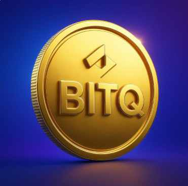

# BIT-QUEEN Token (BITQ)

## Token Details
- **Name:** BIT-QUEEN  
- **Symbol:** BITQ  
- **Decimals:** 18  
- **Total Supply:** 1,000,000,000 (1B)  
- **Blockchain:** Binance Smart Chain (BEP20)  

## Contract Address0xae41B9BecA03Cc13155999E8195A5E17669BfcFa
## How to Add in Wallet
1. Open **Trust Wallet** or **MetaMask**  
2. Click on *Add Custom Token*  
3. Select **BSC / BEP20**  
4. Paste contract address:  
   `0xae41B9BecA03Cc13155999E8195A5E17669BfcFa`  
5. Done ✅

---
